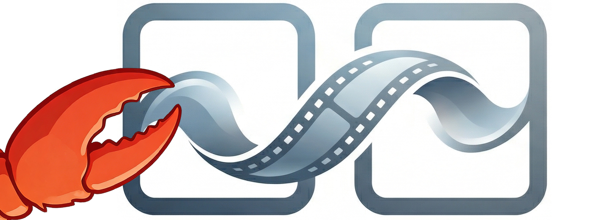
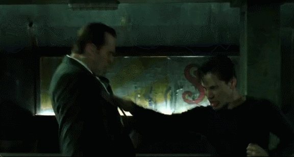
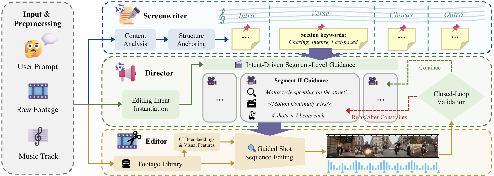
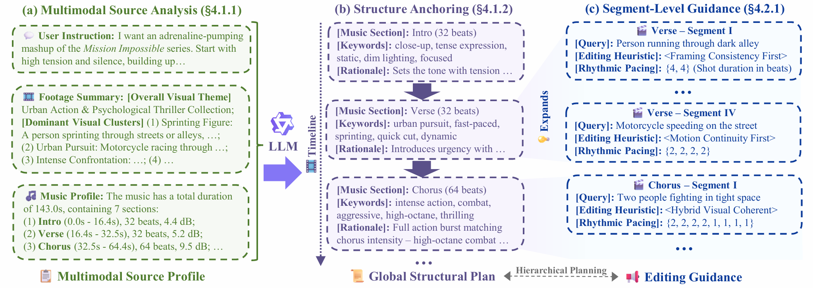
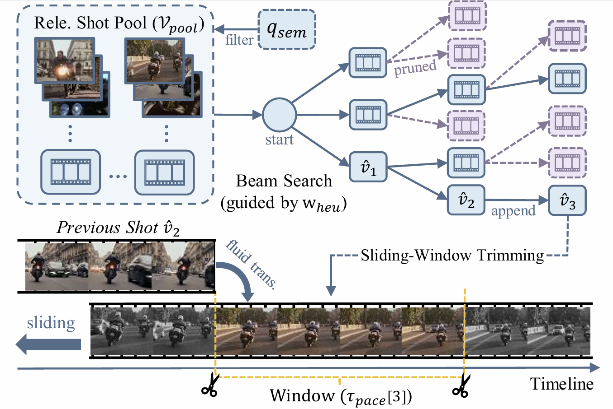
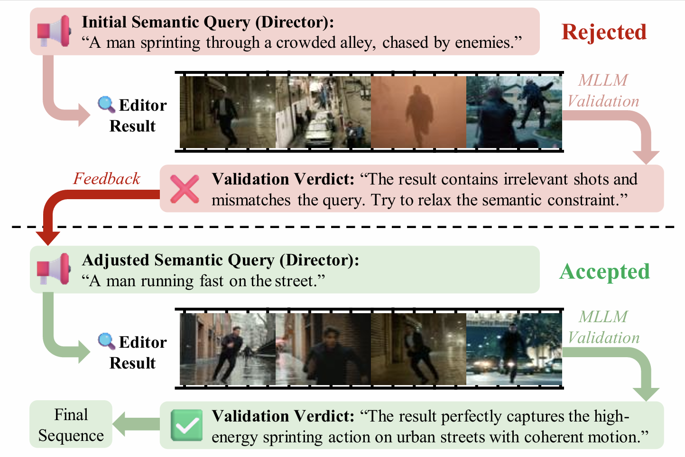

<div align="center">



# DIRECT-Claw: <ins>D</ins>ynamic <ins>I</ins>ntent for <ins>R</ins>etrieval & <br> <ins>E</ins>diting for <ins>C</ins>inematic <ins>T</ins>ransitions

### Video Mashup Creation via Hierarchical Multi-Agent Planning and Intent-Guided Editing

</div>


**TL;DR:** DIRECT-Claw is a hierarchical multi-agent framework for automated **video mashup creation**. Given user instruction, raw video footage and a background music track, it autonomously edits a visually and rhythmically engaging video mashup (e.g. movie montage, anime music video) with cinematic visual continuity and auditory alignment.

<div align="center">

[](https://arxiv.org/abs/2604.04875)
[](https://github.com/AK-DREAM/DIRECT-Claw)
[](https://opensource.org/licenses/MIT)

</div>

## 🎬 Showcases
### Generated Video Clips (Seamless Visual Transitions🪄)
<table width="100%">
<tr>
  <td align="center" width="33%">
  
  </td>

  <td align="center" width="33%">
  
  </td>

  <td align="center" width="33%">
  
  </td>
</tr>
</table>

### Full-length Demo Videos (With Music🎵)
<table width="100%">
<tr>
  <td align="center" width="33%">
  <video src="https://github.com/user-attachments/assets/7b80aad5-b1ab-4511-aaba-5e429432814f" width="100%" controls ></video>
  </td>

  <td align="center" width="33%">
  <video src="https://github.com/user-attachments/assets/063bed64-782b-41de-81fe-496ea08b67f5" width="100%" controls ></video>
  </td>

  <td align="center" width="33%">
  <video src="https://github.com/user-attachments/assets/8f81ad74-86f7-4965-a1eb-5b85580dd454" width="100%" controls ></video>
  </td>
</tr>
</table>

## 🔥 Key Features
- **Hierarchical Multi-Agent Collaboration**: A three-tier architecture (Screenwriter, Director, Editor) that bridges high-level editing intents with frame-level editing precision.
- **Seamless Visual Transitions**: Explicit modeling and optimization for visual-motion continuity and framing consistency to prevent erratic focal jumps and ensure fluid motion flow.
- **Precise Auditory Alignment**: Achieves professional-grade beat-cut synchronization through adaptive editing pace and energy correspondence between musical intensity and visual dynamics.
- **In-depth Multimodal Reasoning**: Hierarchical planning for Global Structural Alignment and Local Segment Cohesion with deep multimodal synergy between shot semantics, visual editing styles, and musical progression.

## ⚙️ System Overview
<p align="center">
  
</p>

System overview. The framework operates through three collaborative modules: the Screenwriter anchors the global structure; the Director instantiates segment-level editing guidance; and the Editor executes fine-grained shot retrieval and orchestration.

<p align="center">
  
</p>

Visualization of the hierarchical planning workflow. The Screenwriter leverages multimodal source analysis to generate a section-wise global structural plan (keywords matching), and the Director expands it into segment-level adaptive editing guidance with precise constraints (semantic query, editing heuristic, rhythmic pacing).

<div align="center">
  
  
</div>

Intent-Guided Shot Sequence Editing. The Editor leverages a tailored beam search algorithm with frame-level dynamic sliding-window trimming to find optimal shot sequences that satisfies both visual continuity and auditory alignment. The validator then detects editing failures caused by rigid constraints and prompts query adjustment to ensure sequence coherence.

## 🚀 Quick Start

### 1. Environment Setup

```bash
git clone https://github.com/AK-Dream/DIRECT-Claw.git
cd DIRECT-Claw
conda create -n direct-claw python=3.12
conda activate direct-claw
conda install -c conda-forge ffmpeg
pip install -r requirements.txt
```

### 2. External Dependencies
- **U-2-Net**: Clone [U-2-Net](https://github.com/xuebinqin/U-2-Net) to the root and download weights following their guide.

- **MLLM Backend**: Configure your endpoint/local path in `configs/agent.yaml`. For instance, we deployed [Qwen3-VL-8B-Instruct](https://huggingface.co/Qwen/Qwen3-VL-8B-Instruct) as our MLLM backend. (Note that the interface in `src/agent/llm_interface.py` might need modification to support video input)

### 3. Data Preparation
Organize your source data as follows:
```plaintext
data/
├── raw_videos/
│   ├── video_1.mp4
│   ├── video_2.mp4
|   └── ...
├── music_tracks/
|   └── bgm.mp3
└── source_videos.csv
```

Your `source_videos.csv` should follow this format:

```csv
video_id,filepath
video_1,raw_videos/video_1.mp4
video_2,raw_videos/video_2.mp4
```
Note: filepath must be a relative path rooted at the `data/` directory.

### 4. Running DIRECT-Claw
**Step 1**: Preprocessing video assets (Extract features & segment shots)
```bash
python -m src.main_preprocess --csv path/to/your/source_videos.csv
```
**Step 2**: Task Configuration
Create a `task.yaml` to configurate your generation task:
```yaml
video_csv: "path/to/your/source_videos.csv"    # Relative to data/
video_fps: 24                                  # Please make sure all source videos have identical frames-per-second!
music_path: "music_tracks/bgm.mp3"             # Relative to data/
user_prompt: "A high-octane movie montage with fast transitions"
```
**Step 3**: Start Generation!
```bash
python -m src.main_agent --yaml_path path/to/your/task.yaml
```

## 💖 Acknowledgments
We would like to express our gratitude to the researchers and developers of the following open-source projects, which were instrumental in the development of **DIRECT-Claw**:
- **[OpenCLIP](https://github.com/openai/CLIP)**
- **[RAFT](https://github.com/princeton-vl/RAFT)**
- **[U-2-Net](https://github.com/xuebinqin/U-2-Net)**
- **[FFmpeg](https://ffmpeg.org/)**
- **[PySceneDetect](https://github.com/Breakthrough/PySceneDetect)**
- **[All-In-One](https://github.com/mir-aidj/all-in-one)**

We also thank the developers of **[Qwen3-VL](https://github.com/QwenLM/Qwen3-VL)** and the **[vLLM](https://github.com/vllm-project/vllm)** framework for providing the high-performance MLLM backend that powers our hierarchical agents.

## 📝 Citation
```bibtex
@article{li2026direct,
  title={DIRECT: Video Mashup Creation via Hierarchical Multi-Agent Planning and Intent-Guided Editing}, 
  author={Li, Ke and Li, Maoliang and Chen, Jialiang and Chen, Jiayu and Zheng, Zihao and Wang, Shaoqi and Chen, Xiang},
  journal={arXiv preprint arXiv:2604.04875},
  year={2026}
}
```